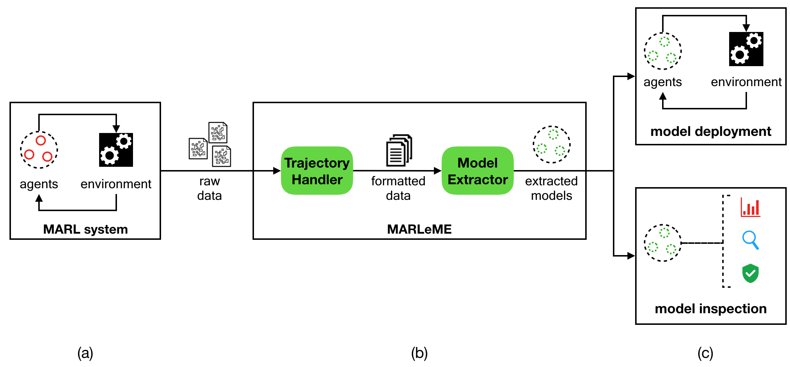

# MARLeME: A Multi-Agent Reinforcement Learning Model Extraction Library


This repository contains an implementation of the MARLeME library. MARLeME is a (M)ulti-(A)gent (R)einforcement (Le)arning (M)odel (E)xtraction library, designed to improve interpretability of MARL systems by extracting interpretable 
models from them. MARLeME can be seamlessly integrated with a wide range of existing MARL tasks, in order to 
improve explainability of the underlying MARL systems.

With the rapidly increasing interest in MARL systems and the development of associated tools,
we believe MARLeME can play a fundamental role in enriching 
such MARL systems and tools with explainability and interpretability. 

MARLeME's modularity permits straightforward extension of its functionality. Thus, we invite interested users to add on to
MARLeME's functionality, by providing new implementations of extracted models, extraction algorithms, and data handling.

## Contents

[Overview](#overview)

[Setup](#setup)

[Data Preprocessing](#data-handling)

[Model Extraction](#model-extraction)

[Using Extracted Models](#extracted-models)

[Generating LIME-based Explanations](#lime-explanation-generation)

[Supported Extracted Models](#supported-extracted-models)

[Files/Directories](#filesdirectories)


## Overview

Multi-Agent Reinforcement Learning (MARL) encompasses a powerful class of methodologies that have been 
applied in a wide range of fields. An effective way to further empower these methodologies is to develop 
libraries and tools that could expand their interpretability and explainability. We introduce MARLeME: 
a MARL model extraction library, designed to improve explainability of MARL systems by approximating them with interpretable models. 
The extracted models can be used to study the behaviour of the underlying agents, as well as to replace all/some of them.


A diagrammatic summary of how MARLeME can be applied to MARL systems is given in Figure 1 below.



*Figure 1: (a) A MARL system consists of a set of RL agents (red circles) interacting with each other and their environment. (b)  MARLeME uses agent trajectory data obtained from the MARL system (raw data), in order to extract a set of interpretable models (green circles) from that data, which approximate the behaviour of the original agents. (c) The interpretable models can replace the original ones (model deployment) or be investigated to better understand the behaviour of the underlying MARL system (model inspection).*


MARLeME is designed to be widely applicable and extendable, and is agnostic to the underlying MARL system implementation. 
Furthermore, MARLeME can be integrated with the well-known [Local Interpretable Model-Agnostic Explanations (LIME)](https://github.com/marcotcr/lime) approach, 
in order to explain individual agent actions, and mine useful heuristics that can be used to improve 
approximation quality of extracted models.


## Setup 

- C++14 (or later)

- Python 3.6 (or later)

- LIME-based components require LIME to be installed. Installation instructions can be found [here](https://github.com/marcotcr/lime#installation)


## Data Handling

MARLeME operates on agent *trajectories* (an agent trajectory consists of a sequence of states and 
corresponding selected actions collected over a set of episodes). In practice, there is a range of ways 
in which trajectory data may be provided to MARLeME by the user, including different data types 
(e.g. as text files, JSON objects, or in databases), data loading behaviour 
(e.g. from a server, or locally), and grouping (e.g. incremental, or batch). 
The *TrajectoryData* module is designed to handle these potential variations, 
before passing the formatted trajectory data to the *ModelExtractor* component.

Currently, we assume trajectory data handlers are only implemented in C++.


### Usage

Trajectory processing is achieved by:
- Creating a trajectory data object (an implementation of the _TrajectoryData_ class), that includes any information relevant to trajectory data loading, extraction, pre-processing etc.
- Creating a state processing object (an implementation of the _StateProcessor_ class), that performs processing of formatted data
- Calling the *processStates* method of the trajectory data object, which applies the processing steps of the state processing object to the raw data

The example below assumes that _TrajectoryDataImpl_, and _StateProcessorImpl_ are task-specific implementations of the _TrajectoryData_, and _StateProcessor_ classes, respectively.


```C++

// Define any task-specific state processing to be performed on formatted trajectory data
StateProcessorImpl stateProcessor(...);

// Create a data trajectory object, designed to serve as a "wrapper" around the state processor,
// performing any task-specific data pre-processing on the raw data
TrajectoryDataImpl trajectoryData(...);

// Apply the formatted data processing with the defined pre-processor
trajectoryData.processStates(stateProcessor);

```

When doing model extraction, the last two steps above are done internally by the extraction algorithm, as will be demonstrated in the next section. 


### Development

In order to implement a new trajectory data, it is necessary to extend
the *TrajectoryData* C++ class with appropriate functionality (see TrajectoryData.h in the "core" folder).


## Model Extraction

The ModelExtractor component is designed to extract interpretable models from 
formatted trajectory data provided by the TrajectoryData. 
This component can utilise extraction algorithms for different types of interpretable models, 
and provide various underlying implementations for these algorithms (e.g. GPU-optimised). 
The resulting models are represented using Team and Agent components (described in the next section).


Currently, we assume model extractors are only implemented in C++, given that model extraction
is performed offline, using MARL trajectory data, and is thus independent of the MARL system.

### Usage

Model extraction is achieved by:
- Creating a trajectory data object (an implementation of the _TrajectoryData_ class)
- Creating a model extractor (an implementation of the _ModelExtractor_ class)
- Calling the _extractModel_ method of the model extractor, in order to extract a model from the trajectory data

The example below assumes that _ModelExtractorImpl_, _TrajectoryDataImpl_, and _TeamModelImpl_ are task-specific implementations of the _ModelExtractor_, _TrajectoryData_, and _TeamModel_ classes, respectively.

```
// Create a trajectory data handling object
TrajectoryDataImpl trajectoryData(...);

// Preliminary trajectory data processing done by the trajectory data object
...

// Create a model extractor object
ModelExtractorImpl modelExtractor(...);

// Extract a model from the trajectory data
TeamModelImpl *teamModel = modelExtractor.extractModel(trajectoryData);

```


### Development

In order to implement a new model extractor, it is necessary to extend
the ModelExtractor C++ class with the new functionality (see ModelExtractor.h in the "core" folder).


## Extracted Models

Extracted agent models are represented using the TeamModel and AgentModel components. 
An AgentModel represents a single agent, and a TeamModel represents a group of agents 
(e.g. teams or sub-teams), giving the user an opportunity to encapsulate agent interactions 
(e.g. state information sharing). Together, these two classes capture the full spectrum of possible 
agent interactions: from fully centralised, with all agents represented by a single TeamModel component, 
to fully decentralised, with all agents running independently (with every agent represented by an AgentModel 
component). These extracted models can be inspected in order to extract new domain knowledge 
regarding the corresponding MARL task, or deployed instead their original models, 
providing more interpretable systems with verifiable properties.

We assume extracted models can be implemented in C++ or in Python.

### Deployment

In order to use a model, simply call the _processState_ or _processStates_ methods, as shown below:


TeamModel processing: 
```C++

// Retrieve next set of agent states
states = ...

// Create a set of vectors holding the model outputs
vector<vector<double>> modelOutputs;

// Compute model outputs from input states
teamModel.processStates(states, modelOutputs);

```

AgentModel processing:

```C++

// Retrieve next agent state
state = ...

// Create vector holding the model output
vector<double> modelOutput;

// Compute model output from input state
agentModel.processState(state, modelOutput);

```

The above examples assume that _teamModel_ is an instance of a class implementing the _TeamModel_ class, and _agentModel_ is an instance of a class implementing the _AgentModel_ class.


### Inspection

Extracted models can be further analysed (e.g. through manual inspection, formal verification, or statistical analysis) to provide insight into the behaviour
of the underlying MARL system at hand.

Typically, this inspection is model-specific. Thus, it is expected that inspection
functionality will be primarily provided with the individual models. See the "examples" folder for examples of how to inspect extracted models.


### Development

Newly-implemented models are assumed to be implemented either in Python,
or in C++.


#### C++

In order to implement a new extracted model in C++, it is necessary to extend
the TeamModel and/or AgentModel C++ classes with appropriate functionality (see AgentModel.h and TeamModel.h in the "core" folder).


#### Python

In order to implement a new extracted model in Python, it is necessary to extend the
TeamModel and/or AgentModel Python classes with appropriate functionality (see AgentModel.py and TeamModel.py in the "core" folder).

Note: this is currently not implemented, but will be implemented shortly.


## LIME Explanation Generation

LIME-based components rely on the _LimeTabularExplainer_ functionality, and discretization of continuous input features (further details can be found [here](https://marcotcr.github.io/lime/tutorials/Tutorial%20-%20continuous%20and%20categorical%20features.html)).
Furthermore, these components assume access to the Q-function of a Reinforcement Learning agent. 

The current _LimeExplainer_ implementation assumes that an agent's Q-function can be accessed by running an agent executable file which:
- Reads state information form a specified file
- Runs the agent policy
- Writes the Q-function values for these states into a specific output file

Thus, the LIME-based components require the following:
- Training data (consisting of a set of agent states), to be used for feature discretization
- Agent executable filename
- Agent input states filename
- Agent output q-values filename 


Generating a single explanation from an input (state, action) pair can be done using the _LimeExplainer_ as follows:

```python

training_states = ...       # Load agent training states
sampled_states_file = ...   # Specify the filepath to the agent state file
q_values_file = ...         # Specify the filepath to the agent Q-values file
agent_cmd = ...             # Specify the path to the agent executable

# Create the LIME explainer
explainer = LimeExplainer(training_states, sampled_states_file, agent_cmd, q_values_file)

input_state = ...           # Specify the input state to be explained
action =      ...           # Specify the action selected by the agent in that state


# Generate the explanation
explanation = explainer.explain(input_state, action)
```

Generating a set of explanations from a set of (state, action) pairs can be done using the _TrajectoryExplainer_ as follows:

```python


training_states = ...       # Load agent training states
sampled_states_file = ...   # Specify the filepath to the agent state file
q_values_file = ...         # Specify the filepath to the agent Q-values file
agent_cmd = ...             # Specify the path to the agent executable

# Create the LIME trajectory explainer
explainer = TrajectoryExplainer(training_states, sampled_states_file, q_values_file, agent_cmd)

input_states = ...           # Specify the set of input states to be explained
input_actions =  ...         # Specify the actions selected by the agent in these states


# Generate the explanations
explanations = explainer.explain(input_states, input_actions)
```


## Supported Extracted Models

Currently supported models are:

- Abstract-Argumentation Agents


## Files/Directories

**Core**: this directory contains the core MARLeME components, focusing on interpretable model extraction and deployment. These components are primarily represented by abstract classes, which place certain restrictions on the kind of behaviour a given component is expected to have, whilst allowing the component to have multiple task-specific implementations.

**Lime**: this directory contains the extra MARLeME components, that make use of the LIME approach. These components allow generation of explanations of specific agent actions, and producing sets of these explanations.

ToDo: complete this section

